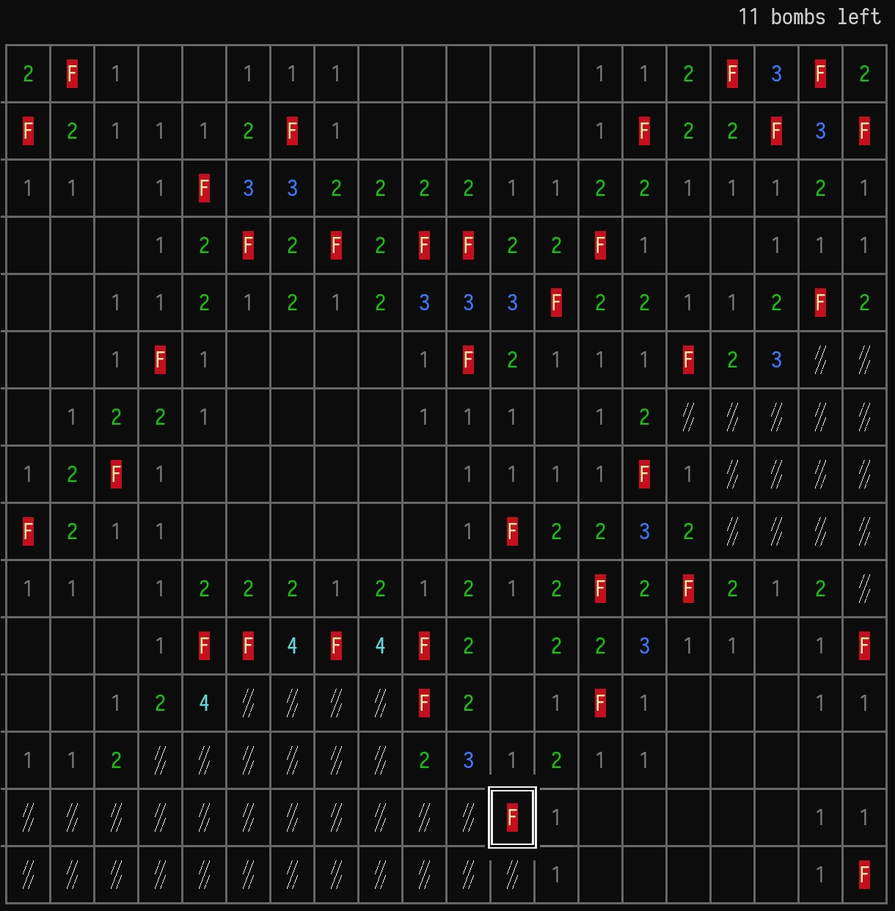

# Minesweeper Clone for Terminal Nerds



## Quick Start

Mines is written in [go](https://go.dev/dl/) so make sure you have it installed before building the game.

## Building 
```console
$ go build virgee.com/mines
```

## Running Mines
```console
$ ./mines 10 10      # 10 rows by 10 columns field, 20% mine population
$ ./mines 10 25      # 10 rows by 25 columns field, 20% mine population
$ ./mines 10 10 25   # 10 rows by 10 columns field, 25% mine population
```

## Controls
| key                                                 | description        |
|-----------------------------------------------------|--------------------|
| <kbd>w</kbd>,<kbd>a</kbd>,<kbd>s</kbd>,<kbd>d</kbd> or <kbd>up</kbd>,<kbd>left</kbd>,<kbd>down</kbd>,<kbd>right</kbd> | Move cursor around |
| <kbd>SPACE</kbd>                                    | Tap a cell         |
| <kbd>f</kbd>                                        | Flag/unflag cell   |
| <kbd>q</kbd>                                        | Quit               |

### **BE AWARE OF THE MINES**
Tapping a cell that contains a mine will make it explode and you'll die. 
Please, tap responsibly.
